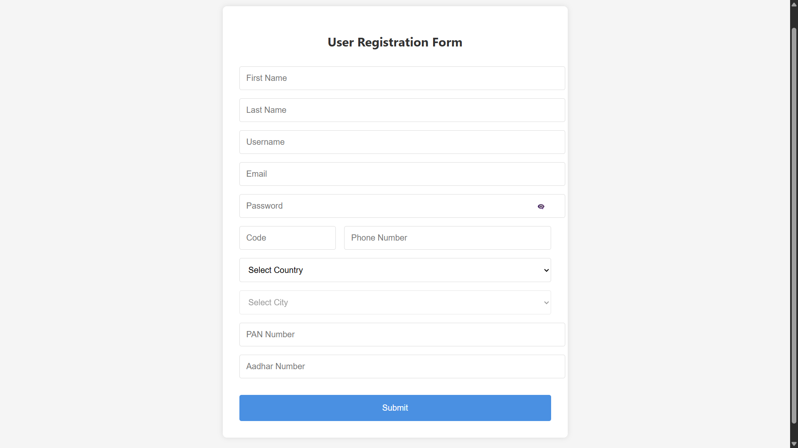
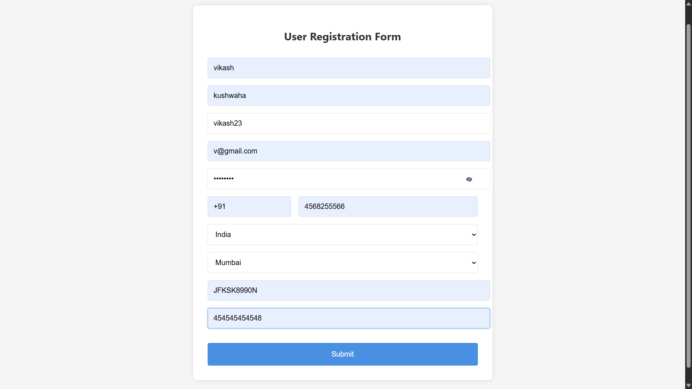
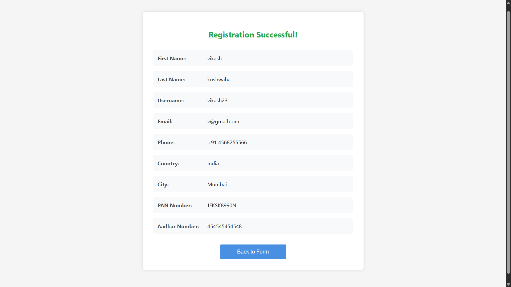

# React Form Validation Project

A React application demonstrating form validation without using any third-party libraries. The project includes a user registration form with various input fields and comprehensive validation.

## Screenshots

### Form Input View


### Form Validation View


### Registration Success View


## Features

- Client-side form validation
- Real-time error messages
- Password show/hide functionality
- Dependent dropdowns (Country-City selection)
- Custom validation for:
  - Email format
  - Password length
  - Phone number format
  - PAN card number format (AAAAA0000A)
  - Aadhar number format (12 digits)
- Success page displaying submitted information

## Form Fields

1. First Name
2. Last Name
3. Username
4. Email
5. Password (with show/hide toggle)
6. Phone Number (with country code)
7. Country (dropdown)
8. City (dynamic dropdown based on country)
9. PAN Number
10. Aadhar Number

## Getting Started

Follow these steps to run the project locally:

1. Clone the repository
2. Install dependencies:
   ```bash
   npm install
   ```
3. Start the development server:
   ```bash
   npm start
   ```
   The application will open in your default browser at `http://localhost:3000`

## Technologies Used

- React
- React Router DOM
- CSS3 (for styling)

## Project Structure

```
forms_and_form_validation/
├── public/
│   ├── index.html
│   ├── favicon.ico
│   ├── manifest.json
│   └── robots.txt
└── src/
    ├── components/
    │   ├── UserForm.js      # Main form component
    │   ├── UserForm.css     # Form styles
    │   ├── Success.js       # Success page component
    │   └── Success.css      # Success page styles
    ├── images/
    │   ├── form-input-view.png
    │   ├── form-validation-view.png
    │   └── registration-success-view.png
    ├── App.js              # Main app component with routing
    ├── App.css             # App-level styles
    ├── index.js            # Entry point
    └── index.css           # Global styles
```

## Validation Rules

- **First Name**: Required
- **Last Name**: Required
- **Username**: Required
- **Email**: Required, must be in valid email format
- **Password**: Required, minimum 6 characters
- **Phone Number**: Required, must be 10 digits
- **Country**: Required selection
- **City**: Required selection
- **PAN Number**: Required, must follow format AAAAA0000A
- **Aadhar Number**: Required, must be 12 digits

## Available Scripts

- `npm start`: Runs the app in development mode
- `npm build`: Builds the app for production
- `npm test`: Launches the test runner

## Contributing

Feel free to contribute to this project by:
1. Forking the repository
2. Creating your feature branch
3. Committing your changes
4. Pushing to the branch
5. Creating a new Pull Request

## Acknowledgments

This project was created as part of the Celebal Technologies React internship program.